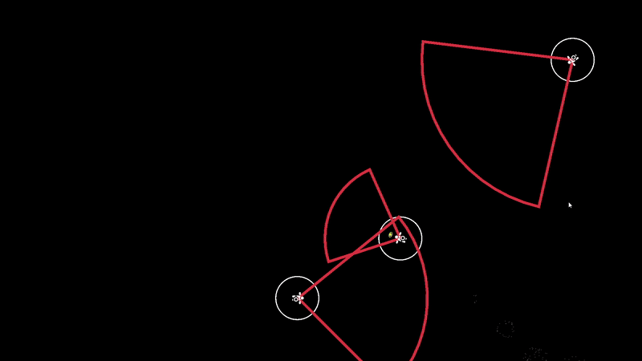
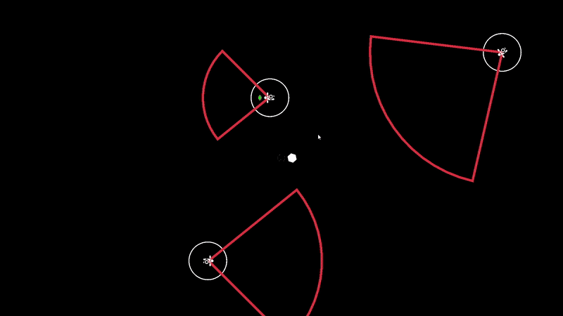
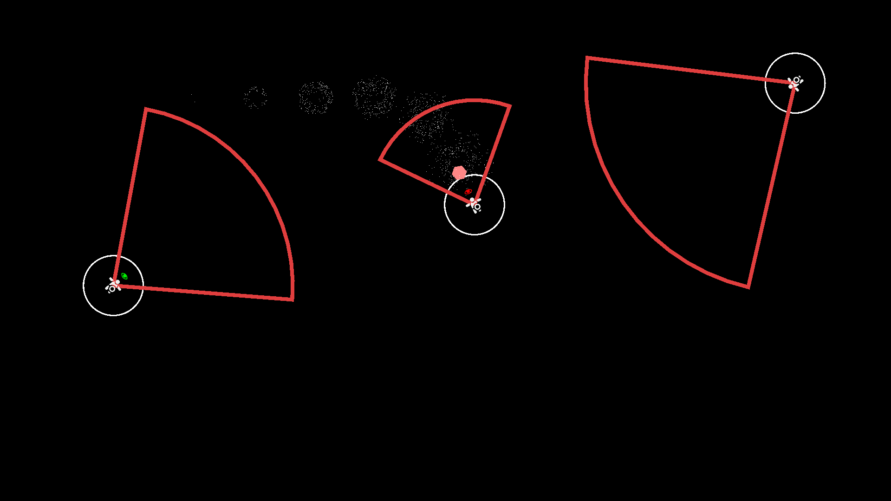
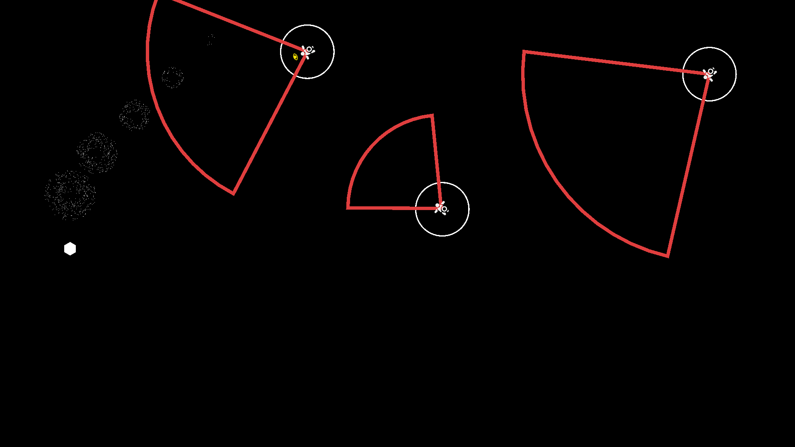
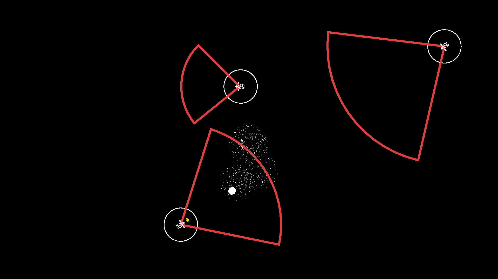

🧠 Stealth AI Prototype (Unity)

A small stealth-oriented AI system built in Unity using a finite state machine, ScriptableObjects, and data-driven design.

The project demonstrates enemy perception, behavior switching, and modular AI architecture suitable for stealth or tactical games.

🎯 Features
✅ Enemy AI System

Finite State Machine (FSM)

States:

Patrol

Idle (Guard)

Investigate

Suspicion

Chase

Search

Return to Post

✅ Perception System

Vision (Field of View)

Hearing (Noise-based detection)

Suspicion level system

Dynamic behavior switching based on threat level

✅ Data-Driven Design

Enemy stats stored in ScriptableObjects

Easy to create new enemy types

No hardcoded values inside logic

✅ Enemy Types

Implemented using EnemyType ScriptableObjects:

Type	Description
Melee	Aggressive close-range enemy
Range	Keeps distance, attacks from afar
Guard	Patrols or stays in a fixed area

🧠 AI Architecture
State Machine

Each enemy runs on a finite state machine:

Idle / Patrol
      ↓
   Suspicion
      ↓
 Investigate
      ↓
    Chase
      ↓
    Search
      ↓
   Return

Transitions depend on:

Vision detection

Sound detection

Suspicion value

Player visibility

Time since last stimulus

👁️ Perception System
Vision

Field of view

Line of sight checks

Player visibility tracking

Hearing

Sound radius

Noise strength

Priority-based noise selection

Suspicion

Increases from:

Vision

Sound

Decreases over time

Controls state transitions

🧱 Code Architecture

✔ SOLID-friendly
✔ No monolithic scripts
✔ Logic separated from data
✔ Expandable enemy behavior

Main components:

Enemy – core logic & state control

EnemyState – base class for all AI states

EnemyType – data container

EnemyFOV – vision logic

Noise – sound system

📦 Technologies

Unity 2D

C#

ScriptableObjects

Finite State Machine

Physics2D

Raycasting

🚀 Possible Improvements

NavMesh / A* pathfinding

Animation controller integration

Stealth takedown system

Group AI behavior

Visual debugging tools

Save/Load system

🧠 What This Project Demonstrates

✔ AI architecture
✔ Game logic design
✔ Clean code practices
✔ Data-driven approach
✔ Scalable systems
✔ Real-world game AI concepts

## 📷 Screenshots

